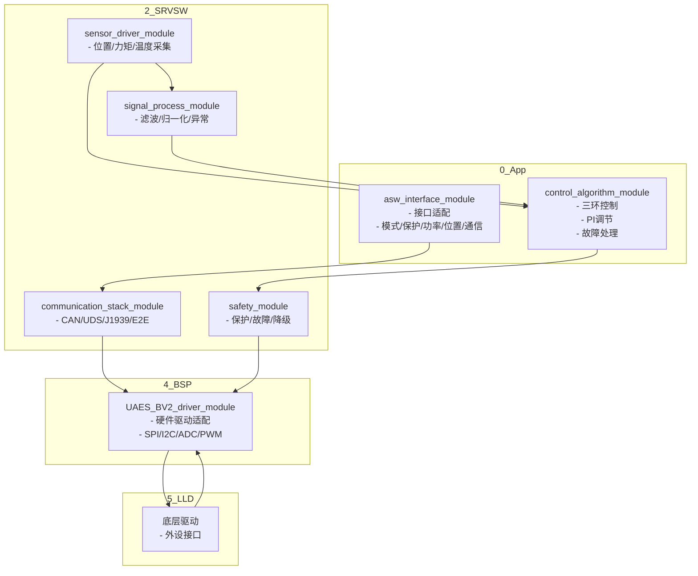

<系统软件分层架构泳道图设计说明>

1. 图层结构：纵向泳道，分为0_App、2_SRVSW、4_BSP、5_LLD四层，每层展示主要模块及关键子模块/接口。
2. 主要模块：
- 0_App：asw_interface_module、control_algorithm_module
- 2_SRVSW：communication_stack_module、safety_module、signal_process_module、sensor_driver_module
- 4_BSP：UAES_BV2_driver_module
- 5_LLD：硬件抽象/驱动层
3. 每个模块细化：
- asw_interface_module：接口适配、模式管理、保护、功率、位置、通信等典型接口
- control_algorithm_module：三环控制（电流/速度/位置）、PI调节、故障处理
- communication_stack_module：CAN通信、UDS诊断、J1939、E2E保护
- safety_module：保护策略、故障检测、降级处理
- signal_process_module：信号滤波、归一化、异常检测
- sensor_driver_module：位置/力矩/温度等传感器采集
- UAES_BV2_driver_module：硬件驱动适配、SPI/I2C/ADC/PWM等
- 5_LLD：底层驱动、外设接口
4. 层间关系：用箭头标注主要调用/数据流（如App→SRVSW→BSP→LLD，CAN报文、传感器数据、控制指令等）。
5. 关键内容高亮，风格统一，drawio可直接导入。

<Mermaid示例，仅供结构参考>

<实际产出请用drawio绘制，结构和内容参考上方说明和Mermaid结构。>